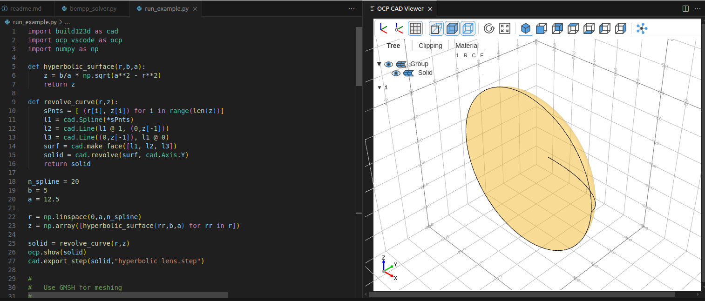
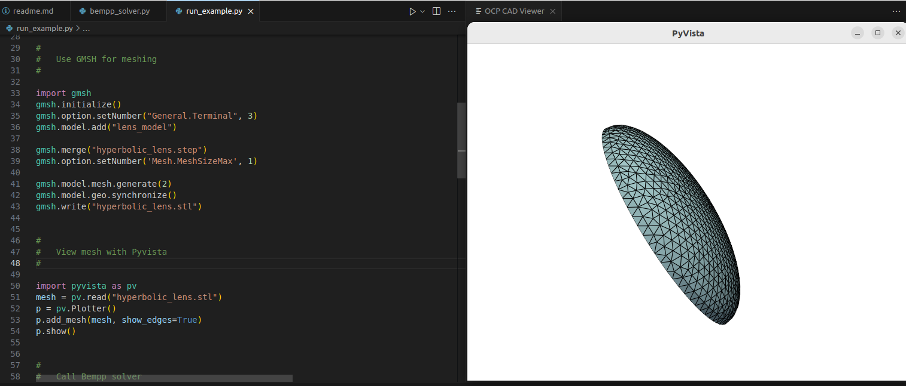
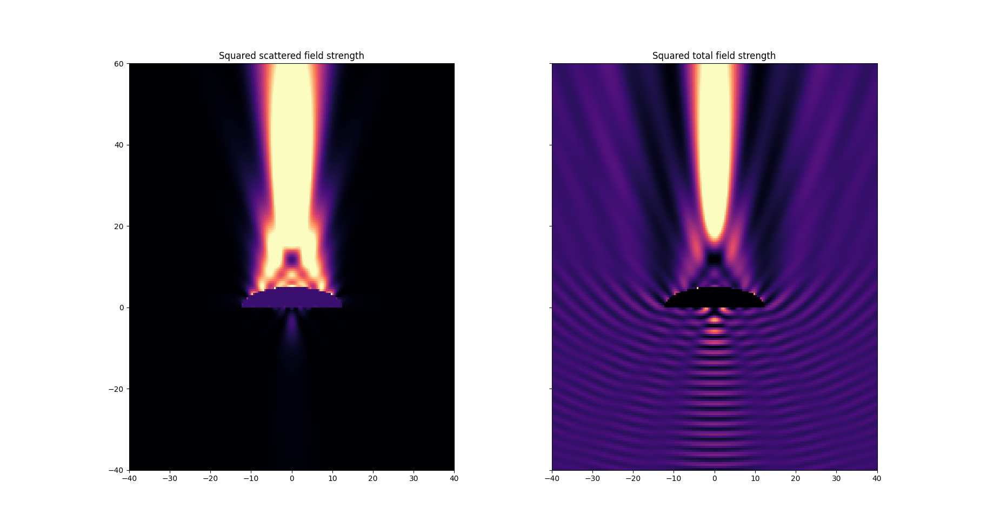

# What is EMForge?

EMForge is an open-source project by [EpsilonForge](www.EpsilonForge.com) to demonstrate an EM modelling and simulation workflow which combines the following open-source tools:

* Parametric CAD modelling via [build123d](https://build123d.readthedocs.io/en/latest/index.html)
* Interactive CAD visualization on VSCode with [ocp_vscode](https://github.com/bernhard-42/vscode-ocp-cad-viewer)
* Mesh generation with [gmsh](https://gmsh.info/)
* [Bempp](https://bempp.com/) for EM simulation via Boundary Elements (aka Method of Moments) of dielectric objects.
* [pyvista](https://pyvista.org/) for visualization

Some of the required (or desirable) dependecies include numba and [exafmm](https://github.com/exafmm/exafmm-t) for fast multipole methods (optional).

## Philosophy: integrate the existing

The open-source EM modeling and simulation ecosystem features several high-quality, mature tools, each designed to excel at a specific task.

However, there are few examples of how to integrate these diverse tools into a unified workflow that is both practical for real-world applications and well-documented to encourage adoption.

This project aims to bridge that gap by demonstrating how existing open-source tools can be effectively combined to tackle real industry challenges.

### Component #1: Python-based parametric CAD in VSCode

The combination of build123d and the ocp_vscode VSCode plugin provides an interactive parametric CAD scripting with with a powerful Pythonic API.

### Component #2: Mesh generation with Gmsh

The popular open-source mesh generator can be integrated into Python with just  a few lines of code. 

### Compoment #3: Bempp as Boundary Elements solver 

This solver is particularly well-suited for solving problems involving unbounded domains, such as scattering problems in electromagnetics. 

The information required by the solver are material properties and sources.

The BEM solver computes the solution to Maxwell’s equations, and results are stored in a format ready for visualization.

## EMForge roadmap

We envision that EMForge could evolve to become a modelling framework with multiple "backend" solvers, centered around numerical approaches to solve Maxwell's equations (Boundary Elements, Finite Elements, and FDTD), but possibly including asymptotic approximations like Physical Optics or other physics-based approximations.

There are many things to do in order to achieve this goal. 

* Defining complex multi-material configurations.
* Integration of FEM and FDTD solvers.
* Optimized mesh generation (i.e. graded meshes nead edges) for best results.
* Deployment tools: easily set up a "simulation" HPC server and access it with a client API.

### Industry collaboration and funding

We're looking forward for industry collaboration and funding, in order to extend the capabilities of EMForge to addesss specific applications in areas like microwave engineering, optics, and electrical machines. 

Industry-funded projects can be consist of the development of additional open-source software modules, different forms of training and consulting activities, or end-to-end simulation projects.

### Get in touch

Are you interested in Electromagnetic Simulation using open-source software? 

This project is in an early development stage, but we're eager to know if we could be of help by providing you with software that is tailored to your required workflow, training, or IT support.

Feel free to ask us anything on the Discussion Forum, or reach out at info@epsilonforge.com

### EpsilonForge

The [EpsilonForge](www.EpsilonForge.com) is a startup company, in the process of spinning off from research activities at the University of Buenos Aires and CONICET. It constitutes a vehicle to provide funding for software development, support, consulting, and training activities in the area of electromagnetic simulation. 

Our core value lies in facilitating engineering innovation through cost-effective simulation software and services

[Check out our website](https://www.epsilonforge.com/) for more information.
